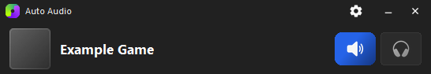
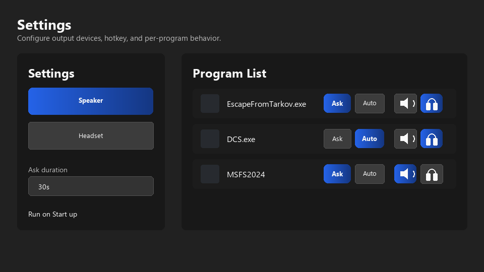

# Auto Audio Switcher

> This project's code was created with OpenAI Codex.
> 이 프로젝트의 코딩은 OpenAI Codex를 활용하여 제작되었습니다.

Auto Audio Switcher is a Windows desktop utility that switches the default audio
output between a speaker device and a headset device based on the programs you
run. It is designed for game-focused workflows where some apps should use a
headset, while the desktop can return to speakers afterward.

## Current Version — v1.0.1

The current UI version focuses on faster audio switching, a compact mini view,
clearer per-program control, and consistent sizing across Windows resolutions
and DPI scale settings.

### Main Features

- **Speaker / Headset output profiles**: choose one Windows output device for
  speaker mode and one for headset mode.
- **Unified Program List**: programs are managed in a single list instead of
  separate Ask and Auto lists.
- **Ask / Auto toggle per program**: each program row can be switched between:
  - **Ask**: shows a small confirmation prompt before changing audio output.
  - **Auto**: changes the audio output immediately when the program is detected.
- **Per-program target output**: each program can target either Speaker or
  Headset.
- **Output Switch Hotkey**: configure a hotkey to manually toggle between
  Speaker and Headset output.
- **Mini view**: a small bottom-screen control panel shows detected programs,
  audio switching status, and quick Speaker / Headset buttons.
- **First-run guide**: new users are guided through output selection and the
  Ask / Auto behavior.
- **Startup option**: the app can be configured to run when Windows starts.
- **Runtime logs**: logs are saved under `logs/auto_audio_switcher.log` to help
  diagnose intermittent detection, prompt, mini-view, and audio-switch issues.
- **Resolution-aware layout**: window, canvas, text, and dropdown dimensions use
  one DPI scale and shrink together when the Windows work area is smaller.

## Installation

1. Download `AutoAudioSwitcher-v1.0.1-Windows-x64.zip` from GitHub Releases.
2. Extract the ZIP file completely.
3. Run `Install_AutoAudioSwitcher.bat`.
4. Start **Auto Audio Switcher** from the desktop or Start menu shortcut.

The installer places the app under `%LOCALAPPDATA%\AutoAudioSwitcher` by
default and preserves existing settings when upgrading. The distribution
already contains the Python runtime and required native libraries, so users do
not need to install Python, pip packages, or Visual Studio separately.

The extracted `AutoAudioSwitcher` folder can also be used as a portable build
by running `AutoAudioSwitcher.exe` directly.

## Feature Highlights

### Settings And Program Rules

Configure speaker and headset output devices, choose ask duration, enable
startup behavior, and manage every program rule from a single program list.

### Ask Or Auto Per Program

Each detected program can use **Ask** or **Auto** behavior. Ask mode shows a
confirmation prompt before changing the output. Auto mode switches immediately
when the matching program is detected.

### Mini View

The mini view appears near the bottom of the screen, shows the current audio
state, and provides quick Speaker / Headset controls without opening the full
settings window.

## Recent UI Behavior

- The mini view animates from the bottom of the screen and hides after
  notifications finish.
- Ask prompts can be answered with the mouse, `Enter` for Yes, or `Esc` for No.
- Ask prompts now force-close correctly even if the mini view had previously
  been pinned by dragging.
- The settings window uses a two-column layout: settings on the left and the
  program list on the right.
- The Add Running Program dialog opens with `Recent`, `A-Z`, and `Resource`
  sorting, with Recent selected by default.

## Requirements

- Windows 10 or Windows 11
- 64-bit Windows
- Packaged EXE build for normal users; Python is bundled
- Python environment only when running from source

## Diagnostic Logs

Runtime logs are stored in the app's `logs` folder:

- `auto_audio_switcher.log`: device detection, switching, prompts, and failures
- `settings_events.log`: compact settings-window interaction timings

Logs rotate automatically to keep disk use bounded. Runtime logs use up to
approximately 3 MB, settings logs use up to approximately 0.75 MB, and rotated
logs older than 14 days are removed. Cleanup runs at startup and every six
hours, so logging does not require a polling thread or continuous disk scans.

When reporting a problem, include the approximate time it happened and attach
the current log files. Logs can contain local device, program, and filesystem
names, so review them before posting publicly.

## Notes

This project is actively being refined around real runtime behavior. If audio
switching, prompt dismissal, or mini-view hiding behaves unexpectedly, check the
latest log file in `logs/` and include the surrounding timestamp when reporting
the issue.
